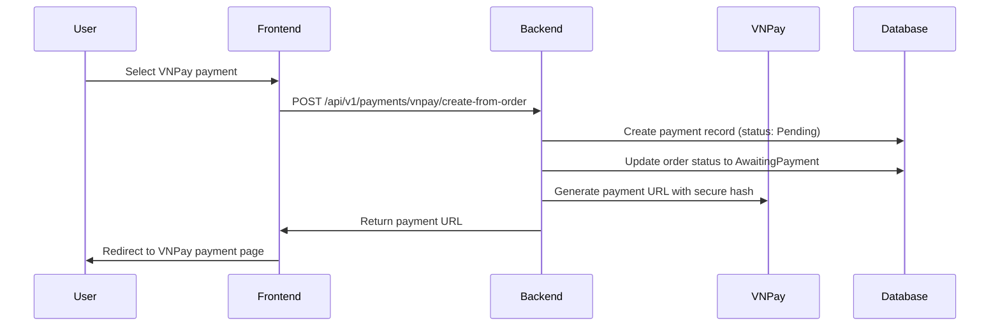
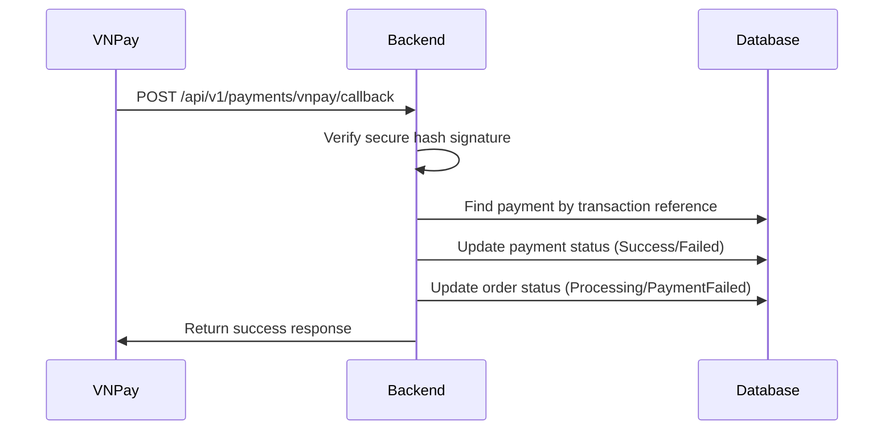

# VNPay Payment Integration Documentation

## Overview

This document describes the VNPay payment gateway integration for the Flowo e-commerce platform. The implementation provides a complete payment flow including payment URL generation, transaction processing, callback handling, and database updates.

## Architecture

### Components

1. **PaymentController** - Handles HTTP requests and responses
2. **PaymentService** - Contains business logic for payment processing
3. **PaymentRepository** - Database operations for payment records
4. **Config** - VNPay configuration management
5. **DTOs** - Data transfer objects for API communication

### Database Schema

```sql
-- Payment table structure
CREATE TABLE Payment (
    payment_id INT PRIMARY KEY AUTO_INCREMENT,
    order_id INT NOT NULL,
    payment_method VARCHAR(50) NOT NULL, -- 'VNPAY', 'COD', 'Paypal'
    payment_status VARCHAR(50) NOT NULL, -- 'Pending', 'Success', 'Failed', 'Refunded'
    transaction_id VARCHAR(255),
    amount_paid DECIMAL(10,2) NOT NULL,
    payment_date TIMESTAMP DEFAULT CURRENT_TIMESTAMP,
    FOREIGN KEY (order_id) REFERENCES `Order`(order_id)
);
```

## VNPay Integration Flow

### 1. Payment Initiation

When a user wants to pay through VNPay:



### 2. Payment Processing at VNPay

The user completes payment on VNPay's secure platform.

### 3. Payment Callback

After payment completion, VNPay calls our callback endpoint:



## API Endpoints

### 1. Create VNPay Payment from Order

**Endpoint:** `POST /api/v1/payments/vnpay/create-from-order`

**Authentication:** Required (Bearer token)

**Request Body:**
```json
{
  "order_id": 123,
  "return_url": "http://localhost:5173/payment/result"
}
```

**Response:**
```json
{
  "payment_url": "https://sandbox.vnpayment.vn/paymentv2/vpcpay.html?...",
  "txn_ref": "ORD1231691234567"
}
```

**Features:**
- Automatically uses order's total amount
- Prevents duplicate payments for already paid orders
- Generates secure VNPay payment URL
- Updates order status to "AwaitingPayment"

### 2. VNPay Callback Handler

**Endpoint:** `POST /api/v1/payments/vnpay/callback`

**Authentication:** Not required (public endpoint for VNPay webhook)

**Request Body (Form Data):**
```
vnp_ResponseCode=00
vnp_TransactionNo=14073218
vnp_BankCode=NCB
vnp_Amount=100000
vnp_PayDate=20240805143022
vnp_TransactionType=01
vnp_TxnRef=ORD1231691234567
vnp_SecureHash=abc123...
```

**Response:**
```json
{
  "RspCode": "00",
  "Message": "Success"
}
```

### 3. Get Payment Status

**Endpoint:** `GET /api/v1/payments/{paymentID}/status`

**Authentication:** Required

**Response:**
```json
{
  "payment_id": 1,
  "order_id": 123,
  "payment_method": "VNPAY",
  "payment_status": "Success",
  "transaction_id": "ORD1231691234567",
  "amount_paid": 150.00,
  "payment_date": "2024-08-05 14:30:22"
}
```

## Configuration

### Environment Variables

Add these to your `.env` file:

```env
# VNPay Configuration
VNPAY_TMN_CODE=your_terminal_code
VNPAY_HASH_SECRET=your_hash_secret
VNPAY_URL=https://sandbox.vnpayment.vn/paymentv2/vpcpay.html
VNPAY_RETURN_URL=http://localhost:5173/payment/result
```

### Default Configuration

If environment variables are not set, the system uses sandbox defaults:

```go
// Default VNPay configuration for development
if config.VNPay.TmnCode == "" {
    config.VNPay.TmnCode = "DEMO"
}
if config.VNPay.HashSecret == "" {
    config.VNPay.HashSecret = "DEMOHASHSECRET"
}
if config.VNPay.URL == "" {
    config.VNPay.URL = "https://sandbox.vnpayment.vn/paymentv2/vpcpay.html"
}
```

## Security Implementation

### Hash Verification

All VNPay communications use HMAC-SHA512 for security:

```go
func (s *PaymentService) generateVNPayHash(data string) string {
    h := hmac.New(sha512.New, []byte(s.Config.VNPay.HashSecret))
    h.Write([]byte(data))
    return hex.EncodeToString(h.Sum(nil))
}

func (s *PaymentService) verifyVNPaySignature(req dto.VNPayCallbackRequest) bool {
    // Create parameter map excluding vnp_SecureHash
    params := map[string]string{
        "vnp_Amount":          req.Amount,
        "vnp_BankCode":        req.BankCode,
        "vnp_PayDate":         req.PayDate,
        "vnp_ResponseCode":    req.ResponseCode,
        "vnp_TransactionNo":   req.TransactionNo,
        "vnp_TransactionType": req.TransactionType,
        "vnp_TxnRef":          req.TxnRef,
    }

    // Generate expected hash and compare
    expectedHash := s.generateVNPayHash(queryString)
    return expectedHash == req.SecureHash
}
```

### Authentication

- Payment creation endpoints require user authentication
- Callback endpoint is public (for VNPay webhook)
- User can only access their own payment records

## Error Handling

### Payment Creation Errors

```go
// Order validation
if order == nil {
    return nil, errors.New("order not found")
}
if order.FirebaseUID != userID {
    return nil, errors.New("unauthorized: order does not belong to user")
}

// Duplicate payment prevention
for _, payment := range existingPayments {
    if payment.PaymentStatus == "Success" {
        return nil, errors.New("order already paid")
    }
}
```

### Callback Error Handling

```go
// Signature verification
if !s.verifyVNPaySignature(req) {
    return &dto.PaymentCallbackResponse{
        RspCode: "97",
        Message: "Invalid signature",
    }, nil
}

// Payment status update
if req.ResponseCode == "00" {
    newStatus = "Success"
    newOrderStatus = "Processing"
} else {
    newStatus = "Failed"
    newOrderStatus = "PaymentFailed"
}
```

## Payment Status Flow

```
Order Created → Payment Created (Pending) → VNPay Payment → Callback → Success/Failed
     ↓                    ↓                        ↓            ↓
Processing        AwaitingPayment              VNPay        Processing/PaymentFailed
```

### Status Definitions

- **Pending**: Payment record created, waiting for user action
- **Success**: Payment completed successfully
- **Failed**: Payment failed or was cancelled
- **Refunded**: Payment was refunded (future enhancement)

### Order Status Updates

- **Processing**: Initial status for COD orders
- **AwaitingPayment**: Order waiting for online payment
- **PaymentFailed**: Online payment failed
- **Processing**: Payment successful, order being processed

## Frontend Integration

### Payment Flow in React

```typescript
// 1. Create VNPay payment
const createVNPayPayment = async (orderId: number) => {
  const response = await fetch('/api/v1/payments/vnpay/create-from-order', {
    method: 'POST',
    headers: {
      'Content-Type': 'application/json',
      'Authorization': `Bearer ${token}`
    },
    body: JSON.stringify({
      order_id: orderId,
      return_url: `${window.location.origin}/payment/result`
    })
  });
  
  const data = await response.json();
  
  // 2. Redirect to VNPay
  window.location.href = data.payment_url;
};

// 3. Handle return from VNPay
const handlePaymentResult = () => {
  const urlParams = new URLSearchParams(window.location.search);
  const responseCode = urlParams.get('vnp_ResponseCode');
  
  if (responseCode === '00') {
    // Payment successful
    showSuccessMessage();
  } else {
    // Payment failed
    showErrorMessage();
  }
};
```

## Testing

### Test Cases

1. **Successful Payment Flow**
   - Create order
   - Generate VNPay URL
   - Simulate successful callback
   - Verify database updates

2. **Failed Payment Flow**
   - Create order
   - Generate VNPay URL
   - Simulate failed callback
   - Verify status updates

3. **Security Tests**
   - Invalid signature verification
   - Unauthorized access attempts
   - Duplicate payment prevention

### Sample Test Data

```go
// Successful callback
req := dto.VNPayCallbackRequest{
    ResponseCode:    "00",
    TransactionNo:   "14073218",
    BankCode:        "NCB",
    Amount:          "15000", // 150.00 VND in cents
    PayDate:         "20240805143022",
    TransactionType: "01",
    TxnRef:          "ORD1231691234567",
    SecureHash:      "generated_hash",
}

// Failed callback
req := dto.VNPayCallbackRequest{
    ResponseCode:    "24", // User cancelled
    // ... other fields
}
```

## Production Deployment

### Configuration Checklist

- [ ] Set production VNPay credentials
- [ ] Configure HTTPS URLs for callbacks
- [ ] Set up proper logging
- [ ] Configure database connection pooling
- [ ] Set up monitoring and alerting

### Production Environment Variables

```env
# Production VNPay Configuration
VNPAY_TMN_CODE=your_production_terminal_code
VNPAY_HASH_SECRET=your_production_hash_secret
VNPAY_URL=https://vnpayment.vn/paymentv2/vpcpay.html
VNPAY_RETURN_URL=https://yourdomain.com/payment/result
IS_PRODUCTION=true
```

## Monitoring and Logging

### Key Metrics to Monitor

1. Payment success rate
2. Callback response times
3. Failed payment reasons
4. Security violations (invalid signatures)

### Logging Implementation

```go
// Success logging
log.Info().
    Str("order_id", strconv.Itoa(payment.OrderID)).
    Str("txn_ref", txnRef).
    Float64("amount", amount).
    Msg("VNPay payment created successfully")

// Error logging
log.Error().
    Err(err).
    Str("txn_ref", req.TxnRef).
    Str("response_code", req.ResponseCode).
    Msg("VNPay callback processing failed")
```

## Troubleshooting

### Common Issues

1. **Invalid Signature Errors**
   - Check hash secret configuration
   - Verify parameter sorting and encoding

2. **Callback Not Received**
   - Ensure callback URL is accessible
   - Check firewall and security settings

3. **Payment Status Not Updated**
   - Verify database connectivity
   - Check transaction handling

### Debug Tools

```go
// Enable debug logging
func (s *PaymentService) debugVNPayRequest(params map[string]string) {
    log.Debug().
        Interface("params", params).
        Msg("VNPay request parameters")
}
```

## Future Enhancements

1. **Refund Support**: Implement VNPay refund API
2. **Webhook Retry**: Add retry mechanism for failed callbacks
3. **Payment Analytics**: Add detailed payment reporting
4. **Multi-currency**: Support for different currencies
5. **Installment Payments**: Support for VNPay installment options

## Support and Maintenance

### VNPay Documentation
- [VNPay API Documentation](https://sandbox.vnpayment.vn/apis/)
- [Integration Guide](https://sandbox.vnpayment.vn/apis/docs/huong-dan-tich-hop/)

### Contact Information
- VNPay Support: support@vnpay.vn
- Technical Issues: Create issue in project repository

---

*Last Updated: August 5, 2025*
*Version: 1.0*
